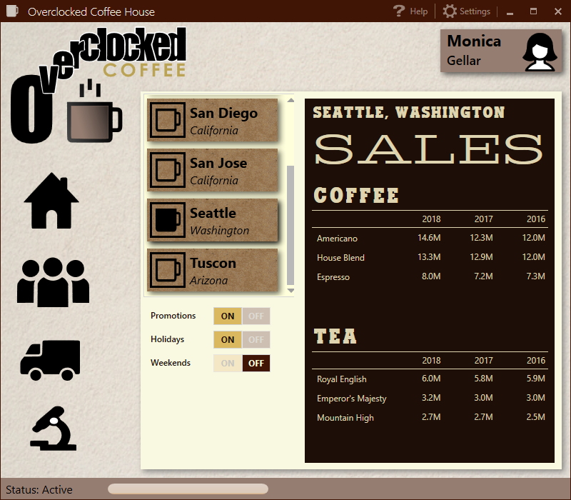
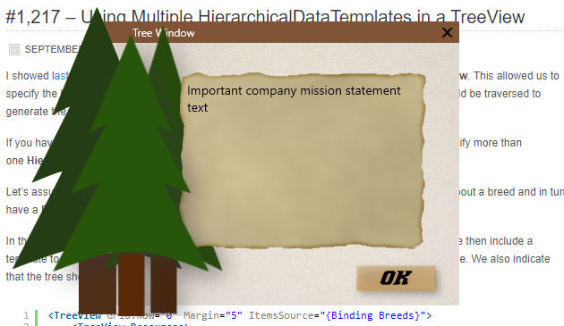

# WPF_Portfolio_Screenshots
Screenshots of various WPF content I've created

This app contains background materials created by using Substance Designer, as well as an implementation of a treemap control.

  

 
Behaviors, triggers, Prism, MahApps Metro (click on screenshot to follow a link to a video demo, hosted on YouTube)

 
Path Animation

3D Application (click on screenshot to follow a link to a video demo, hosted on YouTube)

